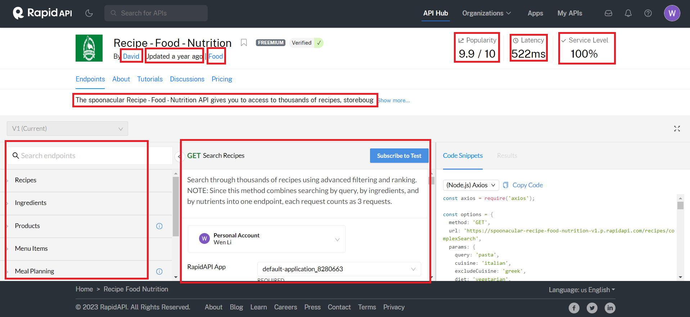
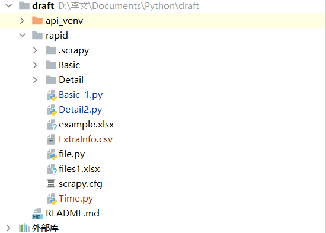

## 目录

#### **1.**[数据集简介](#数据集简介)

#### 2.[版本介绍](#版本介绍)

#### 3.[代码使用说明](#代码使用说明)

- [**项目结构**](#项目结构)
- **[Basic.py](Basic.py)**
- **[Detail.py](Detail.py)**

#### 4.[数据集字段说明](#数据集字段说明)

## 数据集简介

​	所有数据均是使用爬虫从[Rapid API Hub](https://rapidapi.com/hub)中获取的。网站中的API帮助开发者快速编写代码并使用更广泛的API进行开发。爬取这些数据可以帮助研究者用于数据挖掘和信息提取，以发现隐藏的模式、关系和知识，进行服务组合以及服务推荐等深入探索。

​	获取的数据集文件以所属种类命名，一共包含49个种类的API，例如（Email，Sport），每个API包含一个或多个Endpoint。Basic文件中保存了描述API的基本信息，例如API名称，API链接，流行度，服务水平等。Detail文件中保存了该种类API对应的Endpoint信息，如Endpoint名称，可选参数，必选参数等。

## 版本介绍

​	**表格中包含了该程序所使用的软件包名称，版本号。**

| 软件包             | 版本号       |
| :----------------- | ------------ |
| Python             | 3.10         |
| PySocks            | 1.7.1        |
| XlsxWriter         | 3.1.6        |
| attrs              | 23.1.0       |
| beautifulsoup4     | 4.12.2       |
| bs4                | 0.0.1        |
| cffi               | 1.15.1       |
| charset-normalizer | 3.2.0        |
| colorama           | 0.4.6        |
| et-xmlfile         | 1.1.0        |
| exceptiongroup     | 1.1.3        |
| idna               | 3.4          |
| numpy              | 1.26.0       |
| openpyxl           | 3.1.2        |
| outcome            | 1.2.0        |
| pandas             | 2.1.1        |
| pip                | 21.3.1       |
| pycparser          | 2.21         |
| python-dateutil    | 2.8.2        |
| pytz               | 2023.3.post1 |
| requests           | 2.31.0       |
| selenium           | 4.12.0       |
| six                | 1.16.0       |
| sniffio            | 1.3.0        |
| sortedcontainers   | 2.4.0        |
| soupsieve          | 2.5          |

## 代码使用说明

#### 项目结构

**数据集**

Basic文件夹中保存API基本信息，例如API名称，API连接，流行度，服务水平等。

Detail文件夹中保存API中各个Endpoint具体信息，Endpoint名称，可选参数，必选参数等。

**实现代码**

Basic.py是爬取基本信息的Python文件。

#### Detaile.py

Basic.py是爬取各API中具体信息的Python文件。

## 数据集字段说明

**Basic文件字段说明**

| 字段名            | 说明        | 示例                                                 |
| ----------------- | ----------- | ---------------------------------------------------- |
| API名称           | API名称     | NetDetective                                         |
| API链接           | API网络地址 | https://rapidapi.com/tomwimmenhove/api/netdetective/ |
| API Popularity    | 受欢迎度    | 9.5                                                  |
| API Latency       | 使用延迟    | 1,399 ms                                             |
| API Service Level | 服务水平    | 100%                                                 |

**Detail文件字段说明**

| 字段名           | 示例                                                         |
| ---------------- | ------------------------------------------------------------ |
| API名称          | SEO Automations                                              |
| API链接          | https://rapidapi.com/BigFoxMedia/api/seo-automations/        |
| API_Host         | seo-automations.p.rapidapi.com                               |
| Endpoint名称     | GET:Extract Sitemap XML as JSON                              |
| Endpoint描述     | Are you looking for an API that can quickly and easily download and parse sitemap.xml files into JSON format? Look no further! Our API allows you to make a simple GET request, passing in the URL of a sitemap.xml file as a parameter. The API will handle the rest, downloading th... |
| Endpoint种类     | Tier 2 APIs ( Fast )                                         |
| Endpoint必须参数 | [{'参数名': ['your-api-key', 'shortcode'], '参数类型': ['STRING', 'STRING'], '参数注意事项': ['Your APIKey provided by Workable', 'Retrieve detailed job information, including the job description. The shortcode is a unique identifier for each jobs and can be seen by invoking "/jobs"']}] |
| Endpoint可选参数 | [{'参数名': ['address', 'lng', 'lat', 'note'], '参数类型': ['STRING', 'STRING', 'STRING', 'STRING'], '参数注意事项': ['An optional human readable address string where the QR Code will be attached', 'An optional longitude of where the QR Code will be attached', 'An optional latitude of where the QR Code will be attached', 'An optional note']}] |

## 目录

#### **1.**[数据集简介](#数据集简介)

#### 2.[版本介绍](#版本介绍)

#### 3.[代码使用说明](#代码使用说明)

- [**项目结构**](#项目结构)
- **[Basic.py](Basic.py)**
- **[Detail.py](Detail.py)**

#### 4.[数据集字段说明](#数据集字段说明)

## 数据集简介

​	所有数据均是使用爬虫从[Rapid API Hub](https://rapidapi.com/hub)中获取的。网站中的API帮助开发者快速编写代码并使用更广泛的API进行开发。爬取这些数据可以帮助研究者用于数据挖掘和信息提取，以发现隐藏的模式、关系和知识，进行服务组合以及服务推荐等深入探索。

​	获取的数据集文件以所属种类命名，一共包含49个种类的API，例如（Email，Sport），每个API包含一个或多个Endpoint。Basic文件中保存了描述API的基本信息，例如API名称，API链接，流行度，服务水平等。Detail文件中保存了该种类API对应的Endpoint信息，如Endpoint名称，可选参数，必选参数等。

## 版本介绍

​	**表格中包含了该程序所使用的软件包名称，版本号。**

| 软件包             | 版本号       |
| :----------------- | ------------ |
| Python             | 3.10         |
| PySocks            | 1.7.1        |
| XlsxWriter         | 3.1.6        |
| attrs              | 23.1.0       |
| beautifulsoup4     | 4.12.2       |
| bs4                | 0.0.1        |
| cffi               | 1.15.1       |
| charset-normalizer | 3.2.0        |
| colorama           | 0.4.6        |
| et-xmlfile         | 1.1.0        |
| exceptiongroup     | 1.1.3        |
| idna               | 3.4          |
| numpy              | 1.26.0       |
| openpyxl           | 3.1.2        |
| outcome            | 1.2.0        |
| pandas             | 2.1.1        |
| pip                | 21.3.1       |
| pycparser          | 2.21         |
| python-dateutil    | 2.8.2        |
| pytz               | 2023.3.post1 |
| requests           | 2.31.0       |
| selenium           | 4.12.0       |
| six                | 1.16.0       |
| sniffio            | 1.3.0        |
| sortedcontainers   | 2.4.0        |
| soupsieve          | 2.5          |

## 代码使用说明

#### 项目结构

**数据集**

Basic文件夹中保存API基本信息，例如API名称，API连接，流行度，服务水平等。

Detail文件夹中保存API中各个Endpoint具体信息，Endpoint名称，可选参数，必选参数等。

**实现代码**

Basic.py是爬取基本信息的Python文件。

#### Detaile.py

Basic.py是爬取各API中具体信息的Python文件。

## 数据集字段说明

**Basic文件字段说明**

| 字段名            | 说明        | 示例                                                 |
| ----------------- | ----------- | ---------------------------------------------------- |
| API名称           | API名称     | NetDetective                                         |
| API链接           | API网络地址 | https://rapidapi.com/tomwimmenhove/api/netdetective/ |
| API Popularity    | 受欢迎度    | 9.5                                                  |
| API Latency       | 使用延迟    | 1,399 ms                                             |
| API Service Level | 服务水平    | 100%                                                 |

**Detail文件字段说明**

| 字段名           | 示例                                                         |
| ---------------- | ------------------------------------------------------------ |
| API名称          | SEO Automations                                              |
| API链接          | https://rapidapi.com/BigFoxMedia/api/seo-automations/        |
| API_Host         | seo-automations.p.rapidapi.com                               |
| Endpoint名称     | GET:Extract Sitemap XML as JSON                              |
| Endpoint描述     | Are you looking for an API that can quickly and easily download and parse sitemap.xml files into JSON format? Look no further! Our API allows you to make a simple GET request, passing in the URL of a sitemap.xml file as a parameter. The API will handle the rest, downloading th... |
| Endpoint种类     | Tier 2 APIs ( Fast )                                         |
| Endpoint必须参数 | [{'参数名': ['your-api-key', 'shortcode'], '参数类型': ['STRING', 'STRING'], '参数注意事项': ['Your APIKey provided by Workable', 'Retrieve detailed job information, including the job description. The shortcode is a unique identifier for each jobs and can be seen by invoking "/jobs"']}] |
| Endpoint可选参数 | [{'参数名': ['address', 'lng', 'lat', 'note'], '参数类型': ['STRING', 'STRING', 'STRING', 'STRING'], '参数注意事项': ['An optional human readable address string where the QR Code will be attached', 'An optional longitude of where the QR Code will be attached', 'An optional latitude of where the QR Code will be attached', 'An optional note']}] |
