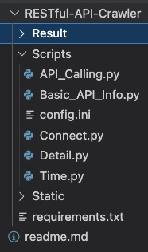
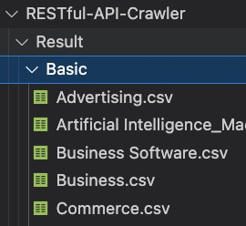
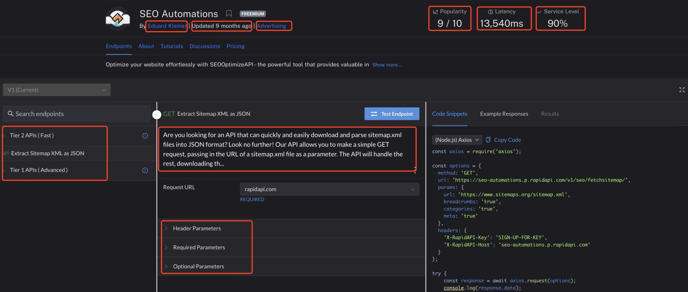

# 目录

1. **[数据集简介](#数据集简介)**
2. **[软件包说明](#软件包说明)**
3. **[代码使用说明](#代码使用说明)**

- **[项目结构](#项目结构)**
- **[核心代码](#核心代码)**
- **[结果保存](#结果保存)**

4. **[数据集字段说明](#数据集字段说明)**
5. **[API 调用及组合示例](5-API调用及组合示例)**

## 数据集简介

所有数据均是使用爬虫从[Rapid API Hub](https://rapidapi.com/hub)中获取的。网站中的 API 帮助开发者快速编写代码并使用更广泛的 API 进行开发。爬取这些数据可以帮助研究者用于数据挖掘和信息提取，以发现隐藏的模式、关系和知识，进行服务组合以及服务推荐等深入探索。

获取的数据集文件以所属种类命名，一共包含 49 个种类的 API，例如（Email，Sport），每个 API 包含一个或多个 Endpoint。Basic 文件中保存了描述 API 的基本信息，例如 API 名称，API 链接，流行度，服务水平等。Detail 文件中保存了该种类 API 对应的 Endpoint 信息，如 Endpoint 名称，可选参数，必选参数等。

## 软件包说明

| 软件包   | 版本号 |
| :------- | ------ |
| pandas   | 2.0.3  |
| selenium | 4.14.0 |

## 代码使用说明

### 项目结构

### 核心代码

[Basic.py](./RESTful-API-Crawler/Scripts/Basic_API_Info.py)：用于爬取 API 的基本信息。

[Detail.py](RESTful-API-Crawler/Scripts/Detail.py)：爬取各 API 中具体信息。

### 结果数据集

`Basic` 文件夹中保存 API 基本信息，例如 API 名称，API 连接，流行度，服务水平等。

`Detail` 文件夹中保存 API 中各个 Endpoint 具体信息，Endpoint 名称，可选参数，必选参数等。

## 数据集字段说明

**Basic 文件字段说明:**

| 字段名            | 说明     | 示例                                                                     |
| ----------------- | -------- | ------------------------------------------------------------------------ |
| API 名称          | API 名称 | SEO Automations                                                          |
| API 链接          | API URL  | [SEO Automations](https://rapidapi.com/BigFoxMedia/api/seo-automations/) |
| API Popularity    | 受欢迎度 | 9.5                                                                      |
| API Latency       | 使用延迟 | 13,540ms                                                                 |
| API Service Level | 服务水平 | 90%                                                                      |

**Detail 文件字段说明:**

---

| 字段名            | 说明                                                                 | 示例                                                                                                                                                                                                                                                                                                                                                   |
| ----------------- | -------------------------------------------------------------------- | ------------------------------------------------------------------------------------------------------------------------------------------------------------------------------------------------------------------------------------------------------------------------------------------------------------------------------------------------------ |
| API 名称          | API 名称                                                             | SEO Automations                                                                                                                                                                                                                                                                                                                                        |
| API 链接          | 此 API 在 RapidAPI 的 URL                                            | SEO Automations API                                                                                                                                                                                                                                                                                                                                    |
| API Host          | 托管或部署 API 的主机服务器或域                                      | seo-automations.p.rapidapi.com                                                                                                                                                                                                                                                                                                                         |
| Endpoint 名称     | 端点提供的操作或功能                                                 | GET: Extract Sitemap XML as JSON                                                                                                                                                                                                                                                                                                                       |
| Endpoint 描述     | 详细解释或说明端点的功能                                             | Are you looking for an API that can quickly and easily download and parse sitemap.xml files into JSON format? Look no further! Our API allows you to make a simple GET request, passing in the URL of a sitemap.xml file as a parameter. The API will handle the rest, downloading th...                                                               |
| Endpoint 种类     | 端点的种类                                                           | Tier 2 APIs (Fast)                                                                                                                                                                                                                                                                                                                                     |
| Endpoint 必须参数 | 向特定端点发出请求时必须提供的参数                                   | `{'参数名': ['your-api-key', 'shortcode'], '参数类型': ['STRING', 'STRING'], '参数注意事项': ['Your APIKey provided by Workable', 'Retrieve detailed job information, including the job description. The shortcode is a unique identifier for each job and can be seen by invoking "/jobs"']} `                                                        |
| Endpoint 可选参数 | 不是端点运行所必需的，但如果需要额外的定制或特定行为，也可以包括在内 | `{'参数名': ['address', 'lng', 'lat', 'note'], '参数类型': ['STRING', 'STRING', 'STRING', 'STRING'], '参数注意事项': ['An optional human-readable address string where the QR Code will be attached', 'An optional longitude of where the QR Code will be attached, 'An optional latitude of where the QR Code will be attached, 'An optional note']}` |

## API 调用及组合示例

1. 订阅 API 以获取特定的 Key，否则测试时会因为未订阅而无法测试
   - 注意：有些 API 可能需要提供国外的银行卡才可以测试
2. 本实验调用了两个 API（[Text Translator](https://rapidapi.com/dickyagustin/api/text-translator2), [OPEN AI](https://rapidapi.com/rphrp1985/api/open-ai21)），第一个 API 用于将我们的问题转换为英文然后传给第二个 API ，随后我们的问题以问答的形式被回答并输出结果，代码查看[API_Calling.py](RESTful-API-Crawler/Scripts/API_Calling.py),如需运行将其中的 API_Key 换成您订阅的 Key。
   - 注意：第二个 API 需要提供相应的上下文以供 OPEN AI 推断
